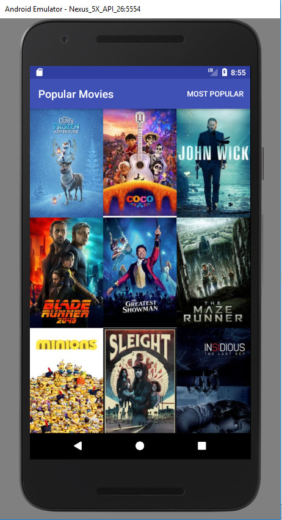
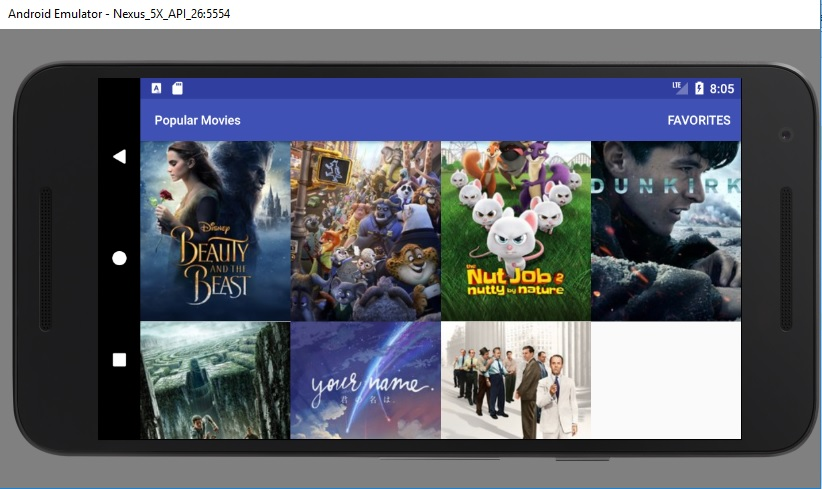
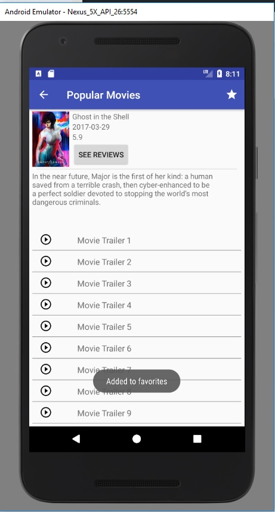

# PopularMoviesStage2
Second stage to the first movie app.
An android app that displays movie data received from The Movie Database API.
This second stage allows users to save movies as favorites as well as view trailers in YouTube and read reviews.

***A MovieDB API Key must be added per the TODO in the NetworkUtils class.

<h2>Screenshots</h2>

